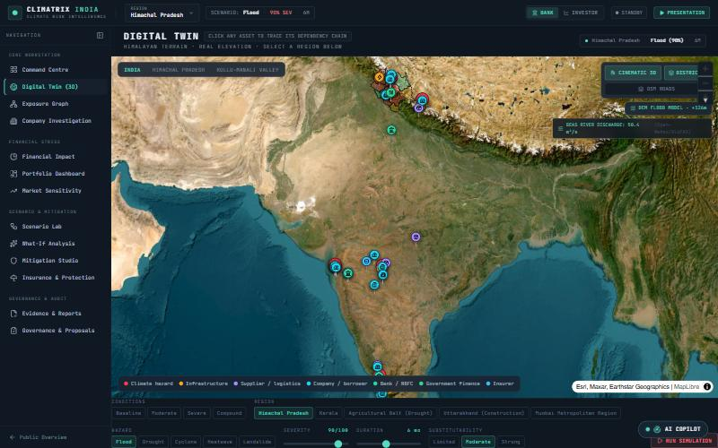
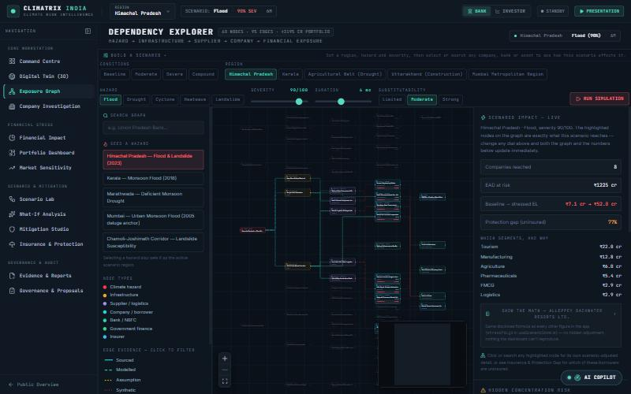
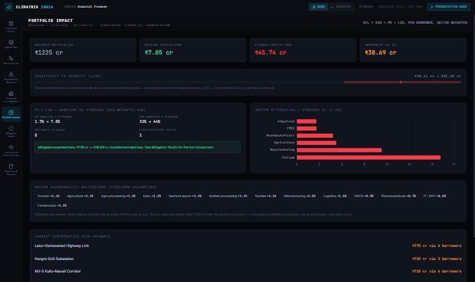
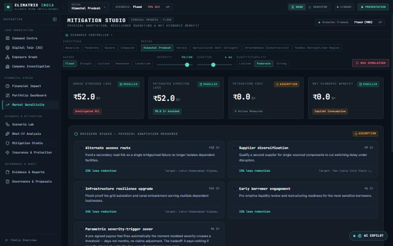
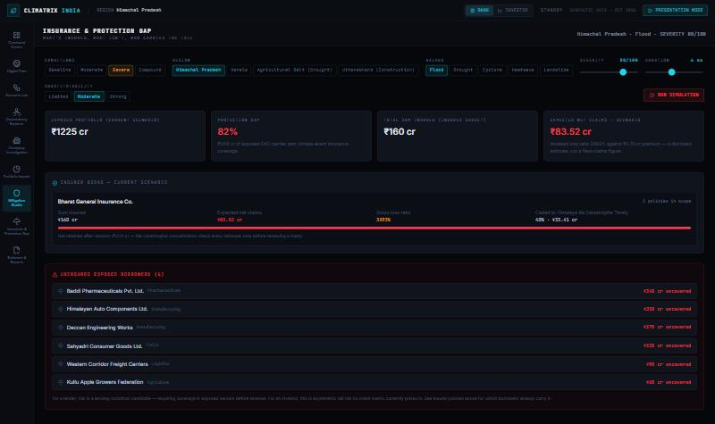
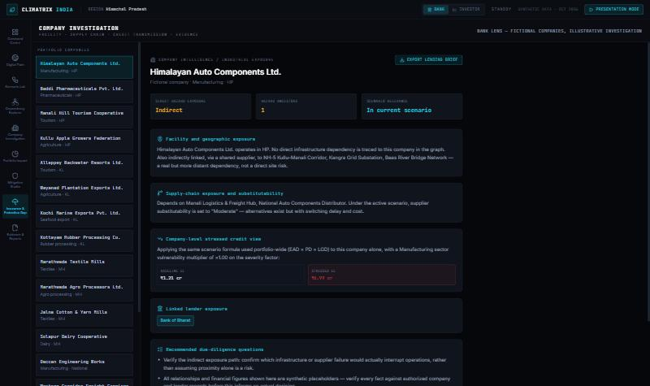
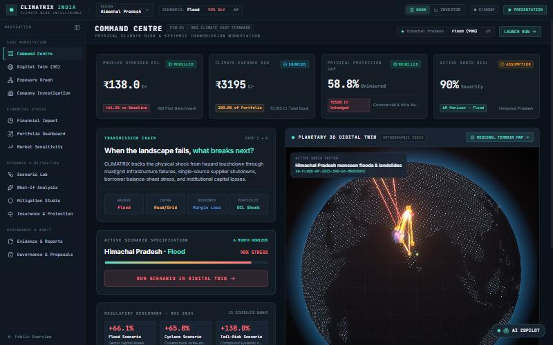
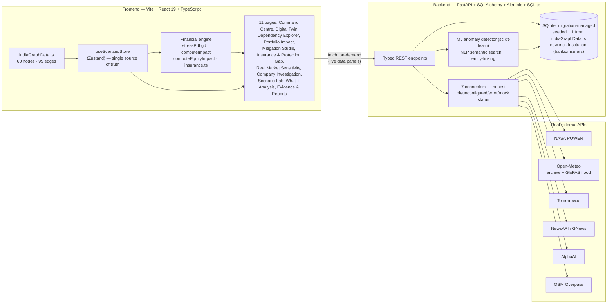

# CLIMATRIX India

**Climate-risk intelligence for investment portfolios — built for FIN-04 ("Climate Exposure Graph for Investment Portfolios"), BlackRock, Fusion 2026.**

CLIMATRIX models how a single physical climate hazard propagates through real
economic structure — infrastructure, suppliers, borrowers, lenders, insurers —
to a financial number a bank, investor or insurer can act on. Change a
scenario dial and watch the exposure graph, the 3D digital twin, the credit
loss, the equity impact and the insurance protection gap all move together,
because they're all reading the same state.

> **Everything in this README is a real, working screenshot of the running
> app** — not a mockup. See [Honest limitations](#honest-limitations--what-this-is-not) for exactly what's real data vs. illustrative.

<p align="center">
  
</p>

---

## Table of contents

- [What problem this solves](#what-problem-this-solves)
- [Feature tour, with screenshots](#feature-tour-with-screenshots)
- [Full feature list](#full-feature-list)
- [Architecture](#architecture)
- [Tech stack](#tech-stack)
- [Real external data](#real-external-data)
- [Evidence integrity system](#evidence-integrity-system)
- [Getting started](#getting-started)
- [Repository structure](#repository-structure)
- [Honest limitations — what this is not](#honest-limitations--what-this-is-not)
- [Roadmap](#roadmap)
- [Documentation index](#documentation-index)

---

## What problem this solves

FIN-04 asks for a system that can: construct a dynamic graph connecting
companies, facilities, suppliers, transport routes, regions and climate
hazards to financial exposure; simulate second- and third-order effects of a
climate event; and surface **hidden** climate exposures in an investment
portfolio that wouldn't show up in a standard credit or equity model.

The named risk in the problem statement itself is that a system like this is
easy to get *wrong* in a way that looks right — a plausible-looking number
with no traceable derivation. CLIMATRIX's organizing principle is the
opposite: **every number on screen can be traced back through the graph to
the hazard that caused it, and every data point is labeled by how real it
is** (see [Evidence integrity system](#evidence-integrity-system)). Nothing
is a black-box confidence score.

## Feature tour, with screenshots

### Digital Twin — real 3D terrain, real elevation, modeled hazard propagation


Native 3D terrain from free AWS Terrarium elevation tiles, Esri satellite
imagery, real India district boundaries, and a **flood extent computed from
the actual decoded elevation data** — not a hand-drawn polygon. Toggle onto
real OpenStreetMap road/bridge geometry (via the Overpass API) instead of
hand-placed points. Click any asset to trace its dependency chain live.

### Dependency Explorer — change the scenario, watch the graph react



A 60-node, 95-edge exposure graph (hazard → infrastructure → supplier →
company → bank/insurer) laid out with `dagre` and rendered in `@xyflow/react`.
Changing region, hazard or severity **immediately** re-highlights exactly
which nodes the new scenario reaches and updates a live impact panel —
company count, EAD at risk, baseline→stressed expected loss, protection gap,
and which sectors are driving the change — with nothing clicked yet.

Company nodes carry a **live stressed-EL badge directly on canvas** — the
real number, not just a highlight color. Click any edge for a plain-
language explanation of what that relationship actually means (what
`DEPENDS_ON` vs. `INSURED_BY` represents) plus its evidence class and
weight. The evidence-class legend is a real **filter** — hide everything
but "Sourced" to see exactly how much of the visible graph is a cited fact
versus a disclosed assumption. And "Show the math" expands a live,
step-by-step trace (baseline PD/LGD → sector vulnerability → stressed
PD/LGD → EAD × PD × LGD) proving the top company's number instead of just
asserting it.

### Portfolio Impact — the financial transmission, sector by sector



`ECL = EAD × PD × LGD`, computed **per company and summed** (never a blended
portfolio average — see [`stressPdLgd`](frontend/src/store/useScenarioStore.ts)).
A disclosed ±15% severity sensitivity band instead of a false-precision point
estimate. Sector attribution shows which industries the stressed loss is
actually coming from, with disclosed vulnerability multipliers (Tourism
1.45×, IT/BPO 0.5×) rather than one flat hazard-to-loss number.

### Mitigation Studio — including a parametric insurance trigger with real basis risk



Toggle structural interventions (alternate routes, supplier diversification,
grid hardening) and watch avoided loss recompute live. The newest lever, a
**parametric severity-trigger cover**, is modeled honestly: it pays a fixed
₹40cr the instant severity crosses 70/100, and pays exactly **₹0** one point
under it — the real all-or-nothing tradeoff ("basis risk") a parametric
buyer accepts for fast, dispute-free payout instead of a slower indemnity
claim. Drag the severity slider across the line and watch net benefit flip
from +₹32cr to -₹6cr (a sunk premium).

### Insurance & Protection Gap — what's covered, what isn't, who carries the tail



Only a deliberate subset of companies in the graph carry insurance (realistic
EM agri/tourism underinsurance), so the **protection gap** stays a genuine
finding instead of being insured away. Per-insurer book stress shows sum
insured, expected net claims, gross loss ratio and reinsurance cession under
the active scenario. The uninsured-exposed list is ranked by EAD — the
actionable output for a lender considering a coverage covenant.

### Company Investigation — due-diligence view with insurance-adjusted credit



A single borrower's full exposure path (direct vs. indirect infrastructure
dependency, kept visually distinct), live stressed PD/LGD, and — new — an
**insurance-adjusted LGD**: for a covered, in-scenario borrower, the modeled
claim payout reduces the lender's effective loss-given-default, shown next
to the plain stressed figure. Exports a lending brief as a text file.

### Command Centre — the opening frame



One scenario summary, one-click launch into a flagship stress run, and
real-world grounding (RBI's own 2024 climate stress-test pilot figures) so
the "why does this matter" case is made before any dial is touched.

---

## Full feature list

### For a bank / credit risk team
- Per-borrower expected credit loss, stressed by a transparent, disclosed
  formula — never a bare confidence score (`stressPdLgd` in
  [`useScenarioStore.ts`](frontend/src/store/useScenarioStore.ts)).
- **Insurance-adjusted LGD** — a covered borrower's effective loss is reduced
  by its modeled claim payout, so the credit view actually knows insurance
  exists.
- Hidden concentration risk detection — shared infrastructure/supplier nodes
  whose failure reaches multiple otherwise-unrelated borrowers
  (`computeBottlenecks`).
- Institution-level exposure: "how would heavy rain affect Union Pradesh
  Bank specifically" answered structurally via graph intersection
  (`institutionExposureToHazard`), not a keyword search.
- Mitigation cost/benefit modeling, including a parametric insurance lever
  with real basis risk (see above).
- Due-diligence export per borrower (text file, generated live from computed
  state).

### For an equity / portfolio investor
- A separate equity lens (`computeEquityImpact`) — revenue-at-risk and
  margin impact, not a credit metric repackaged. Disclosed assumption ratios
  (exposed-revenue share, operating margin), stated as assumptions.
- Dependency Explorer and Digital Twin double as a dependency *explainer*:
  trace exactly which infrastructure and suppliers sit between a hazard and
  a holding.
- Sector attribution with disclosed climate-vulnerability multipliers per
  sector, so sector allocation calls are grounded in the same propagation
  model as the credit view.

### For an insurer / reinsurer
- **Protection gap analysis**: of everything a scenario reaches, what
  fraction carries zero coverage (`computeProtectionGap`).
- Per-insurer book stress: sum insured, expected net claims, gross loss
  ratio, and what share cedes to a reinsurance treaty
  (`computeInsurerBook`).
- A second, **PMFBY-style subsidized scheme** insurer alongside the private
  one — models the real scheme's defining mechanic, where a government
  subsidy covers most of the actuarial premium so the insured grower pays
  only a small flat share, shown as an explicit farmer-paid vs. subsidy
  split per insurer book.
- Catastrophe-concentration visibility — the same hidden-bottleneck
  detection the bank view uses, applied to an insurer's own book.

### AI Copilot — a guide, not a wrapper around an LLM
- **Rules-first, local-model fallback**: precise regex rules resolve most
  messages for free and instantly; a local Ollama model is consulted only
  when the rules aren't confident, and even then it only ever picks ONE
  intent from a closed list — it never computes or writes an answer. Every
  number the Copilot shows comes from the exact same engine every
  dashboard page uses, so it can never disagree with what's on screen.
- **It operates the dashboard, not just describes it** — "set severity to
  85 and duration to 9 months" actually moves the live scenario dials
  (every page updates, not just the chat), "guide me to the map" navigates
  and starts the simulation clock, "download a brief" produces the file.
- **Company and institution lookup by name** — ask about a specific
  borrower or bank/insurer and get its live, scenario-adjusted exposure,
  insurance-adjusted LGD, and dependency path — not a keyword search.
- **Region comparison** under matched dials, a **methodology explainer**
  that states the actual formulas, and an autonomous **What-If multi-
  scenario engine** (four archetypes, ranked by loss/likelihood/priority)
  plus a cross-region **portfolio overview** — both downloadable as plain-
  text briefs.
- **A real bridge to the backend's ML/NLP layer** — "has anything
  anomalous happened with the weather here" calls the live scikit-learn
  anomaly detector; "search news about X" calls the live TF-IDF semantic
  search — the Copilot isn't frontend-only.
- **Reverse stress testing** — "what severity would it take to breach ₹500
  cr in losses" runs a real binary search over the same engine (not a
  lookup table), and honestly reports when a target isn't reachable at the
  current duration/substitutability instead of guessing.

### Real Market Climate Sensitivity — real companies, disclosed framework
A separate lens from the synthetic portfolio: 18 real, publicly listed
Indian companies (Taj/Indian Hotels, Adani Green, L&T, UltraTech Cement,
ICICI Lombard, ONGC, TCS, Sun Pharma and more) classified by climate
sensitivity **direction** — `exposed`, `beneficiary`, `mixed`, or
`resilient` — not every climate story is a liability; reconstruction
demand for cement/infrastructure majors and policy tailwinds for
renewables are modeled as real upside, not smoothed away. Click any
company for its worst-case scenario, how it could favor them, and a
**live real-news search** via the backend's NewsAPI/GNews connector.
Clearly disclosed as this prototype's own illustrative framework — never
a sourced ESG rating or investment advice.

### Scenario engine (shared by every view above)
- One Zustand store (`useScenarioStore`) is the single source of truth for
  region, hazard, severity, duration, substitutability and active
  interventions — every page reads the same state, so map, graph, financial
  figures and narrative text can never drift apart.
- Four built-in profiles from ordinary conditions to compound/prolonged
  stress, or any custom dial combination.
- Saved scenarios (localStorage), a scripted Presentation Mode, and a
  causal-replay timeline derived from the actual graph BFS (not a
  hardcoded disaster script).
- Bank ⇄ Investor lens toggle in the top bar — same scenario, two different
  financial outputs, modeled separately rather than one metric repurposed.

### Real data, not just a synthetic demo
- Seven live external connectors (NASA POWER, dual Open-Meteo archive/flood,
  Tomorrow.io, NewsAPI+GNews, AlphaAI, OSM Overpass) — see
  [Real external data](#real-external-data).
- Real India district boundaries, real DEM elevation tiles, real OSM road
  geometry, real historical weather, real river discharge, real news search.
- A four-way evidence taxonomy (`sourced` / `modelled` / `assumption` /
  `synthetic`) applied per data point throughout, not just in one disclaimer
  page — see [Evidence integrity system](#evidence-integrity-system).

### Backend
- FastAPI + SQLAlchemy, schema shared 1:1 with the frontend's graph IDs (no
  ID-reconciliation layer needed if the frontend later becomes
  backend-authoritative) — including a real `Institution` table for
  banks/insurers, previously only ever dangling edge-endpoint strings.
- **Migration-managed schema** — Alembic, no `create_all()`.
- **A real ML layer**: scikit-learn `IsolationForest` + rolling z-score
  weather anomaly detection, requiring both methods to agree before
  flagging a day anomalous (`GET /api/weather/anomalies`).
- **A real NLP layer**: TF-IDF semantic search and gazetteer entity-linking
  over news/evidence (`GET /api/search/semantic`; fetched articles are
  linked to the specific companies/regions they mention).
- Per-scenario and per-portfolio **data-quality rollups** — what share of a
  result is actually evidence-backed, computed once per run/portfolio, not
  eyeballed from the graph.
- A real **geocoding pipeline** (free Nominatim) for new assets, replacing
  an asserted `'approximate'` default.
- Every connector reports an honest status (`ok` / `unconfigured` / `error`
  / `mock`) — never a silently empty success.
- 40 passing backend tests: financial/insurance-formula parity with the
  frontend, connector honesty under failure, ML/NLP/data-quality coverage,
  API surface.

## Architecture



The frontend is intentionally **not** backend-authoritative for the core
graph: `indiaGraphData.ts` is the fast, offline-safe source for the
interactive demo, and the backend is an additive, independently real layer
(same IDs, same financial formula, verified numerically identical — see
`backend/tests/test_financial.py`) proving the path to a backend-driven
version is a data-source swap, not a rewrite. See
[`docs/ARCHITECTURE.md`](docs/ARCHITECTURE.md) for the full design
rationale, including why SQLite over Postgres/PostGIS at this stage.

## Tech stack

| Layer | Choice |
|---|---|
| Frontend framework | React 19 + TypeScript, Vite |
| State | Zustand (single store) |
| Routing | `react-router-dom` (`HashRouter`) |
| 3D map | MapLibre GL JS (`react-map-gl`) — real terrain, no Cesium, no API key |
| Graph visualization | `@xyflow/react` + `dagre` auto-layout |
| Charts | `echarts-for-react` |
| Animation | `framer-motion` |
| Styling | Tailwind CSS v4 |
| Backend | FastAPI, SQLAlchemy 2.0, Pydantic v2 |
| Database | SQLite (Postgres/PostGIS-ready via `DATABASE_URL`), migration-managed via Alembic |
| ML / NLP | scikit-learn (`IsolationForest`, TF-IDF + cosine similarity), numpy |
| HTTP client | `httpx` (async) |
| Testing | `pytest` + `pytest-asyncio` (backend), `tsc --noEmit` (frontend) |

## Real external data

| Connector | What it adds | Auth | Surfaces in |
|---|---|---|---|
| NASA POWER | Historical daily precipitation/temperature | None (free) | Evidence & Reports |
| Open-Meteo (archive) | Second independent historical reanalysis, automatic fallback | None (free) | Evidence & Reports |
| Open-Meteo (flood/GloFAS) | Real river discharge (m³/s), Beas corridor | None (free) | Digital Twin badge |
| Tomorrow.io | Live current conditions | API key | Digital Twin badge |
| NewsAPI + GNews | Region/hazard-scoped real news, automatic fallback | API key | Evidence & Reports |
| AlphaAI | Relevance-scored financial news + insider summaries | API key | Evidence & Reports |
| OSM Overpass | Real road/bridge way geometry | None (free) | Digital Twin layer |

Every connector that accepts a server-side key had its response checked for
leaking that key back to the client (three did, by default, via the query
string — fixed by constructing a redacted display URL). See
[`docs/DATA_STRATEGY.md`](docs/DATA_STRATEGY.md) for the full connector
build log and the prioritized roadmap for what's next.

## Evidence integrity system

Every data point in CLIMATRIX is labeled with one of four evidence classes,
surfaced consistently across the graph, the map and the Evidence & Reports
page — not just disclosed once and forgotten:

| Class | Meaning |
|---|---|
| **Sourced** | A real, cited, externally verifiable fact (district boundaries, RBI pilot figures, a live API response) |
| **Modelled** | A real computation over real or synthetic inputs (the DEM flood ribbon, the ECL formula) |
| **Assumption** | A disclosed illustrative parameter the user can see and judge (sector vulnerability multipliers, intervention cost/benefit) |
| **Synthetic** | Fabricated for the demo and labeled as such everywhere it appears (company names, loan exposures — no real Indian borrower, bank or supplier data is used anywhere) |

## Getting started

Full setup instructions, including backend connector API keys and the
seed-data regeneration workflow, are in
**[`docs/GETTING_STARTED.md`](docs/GETTING_STARTED.md)**. Quick version:

```bash
# Frontend (the interactive demo — works standalone, no backend required)
cd frontend
npm install
npm run dev          # http://localhost:5181

# Backend (optional — powers the "live data" panels and the typed API)
cd backend
python -m venv .venv
.venv/Scripts/python.exe -m pip install -r requirements.txt   # Windows
cp .env.example .env
.venv/Scripts/python.exe -m app.db.seed
.venv/Scripts/python.exe -m uvicorn app.main:app --reload --port 8000
```

## Repository structure

```
frontend/            Vite + React 19 + TypeScript SPA (the interactive demo)
  src/lib/            Pure functions: graph data, graph analytics, financial
                       engine helpers, insurance engine, sector vulnerability
  src/store/           useScenarioStore.ts — the single source of truth
  src/pages/           One file per top-level page/route
  src/components/      Shared UI, the graph node/inspector, map layers
backend/              FastAPI + SQLAlchemy + SQLite API
  app/connectors/      One file per real external data source
  app/api/             Typed REST routers
  app/models/          SQLAlchemy schema
  tests/               pytest suite
docs/                 Design docs, data strategy, this doc set
  images/              Real screenshots used in this README
```

## Honest limitations — what this is not

- **Company, loan-exposure and bank/supplier relationship data is entirely
  synthetic.** No real Indian borrower, bank or supplier data is used
  anywhere in this prototype — every occurrence is labeled `synthetic`.
- **The flood ribbon, hazard zones and claim/payout formulas are disclosed
  models, not calibrated engineering, actuarial or hydrological outputs.**
  They're built from real inputs (real elevation data, real district
  boundaries) through a transparent formula you can read in the source, not
  a black box.
- **The backend is additive, not yet authoritative.** The frontend's
  interactive demo runs on its bundled dataset for speed and offline
  reliability; the backend is a real, tested, independently verified parallel
  layer proving the migration path, not yet the live source of truth.
- **No auth, no multi-tenant boundaries, no production deployment
  configuration.** This is a hackathon prototype; see
  [`docs/IMPLEMENTATION_AUDIT.md`](docs/IMPLEMENTATION_AUDIT.md) for a full,
  dated audit of what's real vs. decorative.

## Roadmap

Not built, scoped and ready to pick up:

- **RBI climate-stress-test-aligned export template** — align the Evidence &
  Reports export format with the RBI's own 2024 pilot methodology.
- **Scenario comparison mode** — run two scenarios side by side instead of
  only sequentially.
- **data.gov.in connector** to upgrade district risk scores from
  `assumption` to `sourced`.
- See [`docs/DATA_STRATEGY.md`](docs/DATA_STRATEGY.md) for the full
  prioritized backlog, including linkage work recommended *before* adding
  more connectors.

## Documentation index

| Doc | What's in it |
|---|---|
| [`docs/FEATURES.md`](docs/FEATURES.md) | Every feature, module by module, with what's real vs. modeled |
| [`docs/ARCHITECTURE.md`](docs/ARCHITECTURE.md) | System design, state architecture, data linkage, financial formulas |
| [`docs/GETTING_STARTED.md`](docs/GETTING_STARTED.md) | Full setup: frontend, backend, connector API keys, seed data |
| [`docs/DATA_STRATEGY.md`](docs/DATA_STRATEGY.md) | Connector build log and prioritized data/linkage roadmap |
| [`docs/IMPLEMENTATION_AUDIT.md`](docs/IMPLEMENTATION_AUDIT.md) | Dated, point-in-time audit of what's real vs. decorative |
| [`backend/README.md`](backend/README.md) | Backend-specific setup, testing, and the SQLite-vs-Postgres rationale |
| [`frontend/README.md`](frontend/README.md) | Frontend-specific dev commands and structure |
