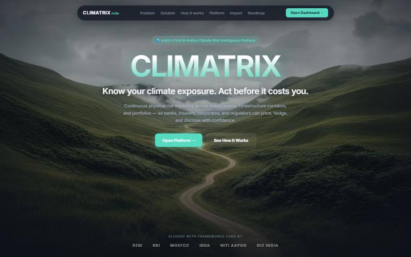
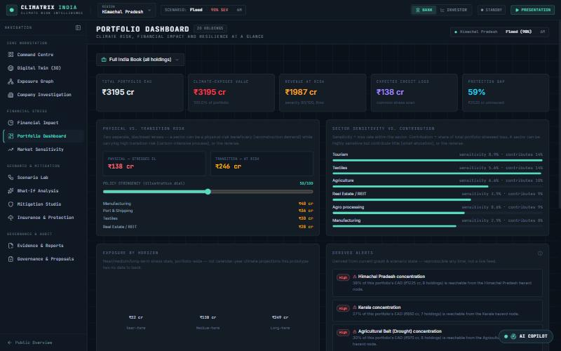
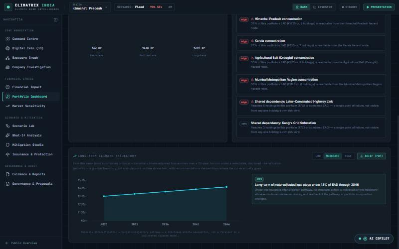
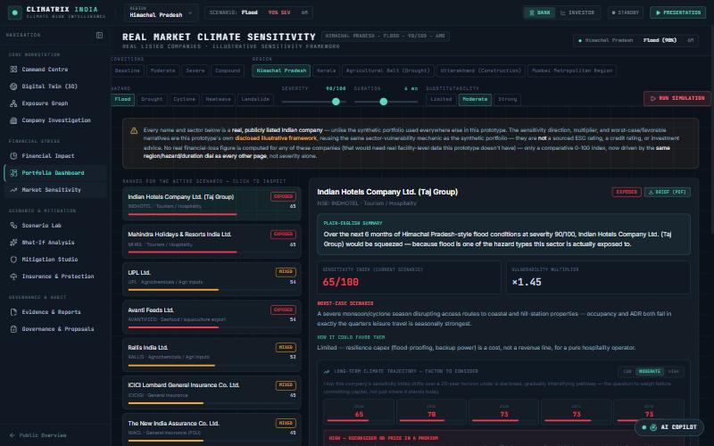
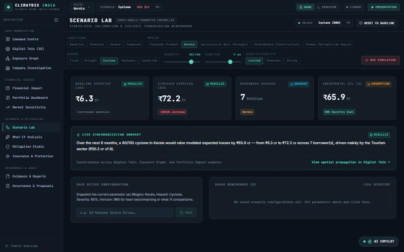
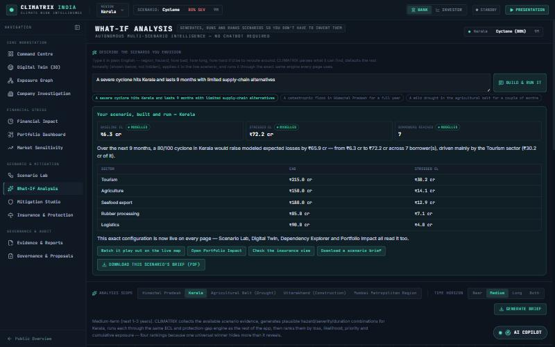
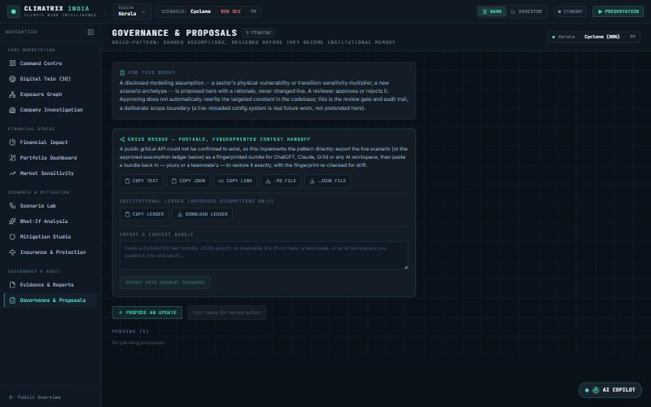
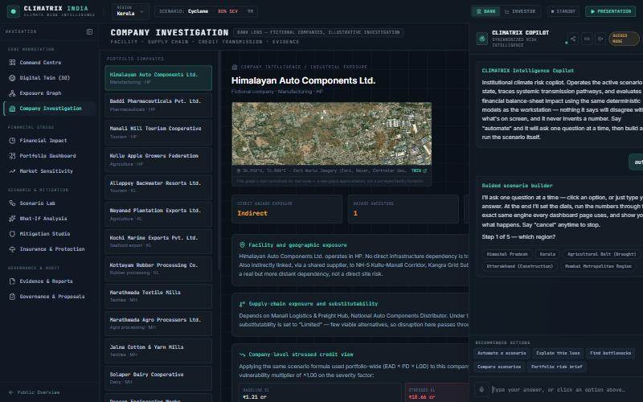
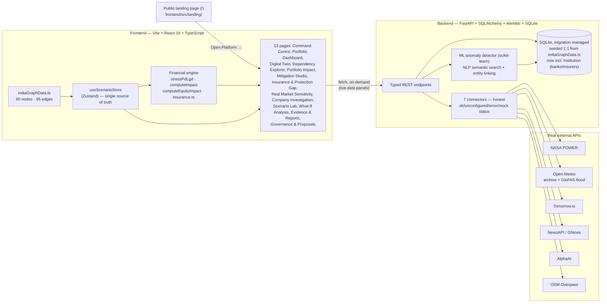

<p align="center">
  
</p>

<h1 align="center">CLIMATRIX India</h1>
<p align="center"><b>A climate-exposure graph for investment portfolios — built for FIN-04 (BlackRock, Fusion 2026)</b></p>

<p align="center">
  
  
  
  
  
  
</p>

<p align="center">
  <b>FinTech · ClimateTech · RegTech · ESG · Physical &amp; Transition Climate Risk · Credit Risk Analytics ·<br>
  Graph-Native Financial Modeling · Explainable AI · Digital Twin · Parametric Insurance · Protection Gap</b>
</p>

CLIMATRIX models how a single physical climate hazard propagates through real
economic structure — infrastructure, suppliers, borrowers, lenders, insurers —
to a financial number a bank, investor or insurer can act on. Move a scenario
dial and watch the exposure graph, the 3D digital twin, the credit loss, the
equity impact, the insurance protection gap, and a 20-year climate-intensification
trajectory all move together, because every view reads the exact same
underlying state. Describe a scenario in plain English, or let the built-in AI
Copilot ask you five questions and build it for you — then download a
decision-ready PDF brief.

> **Every screenshot in this README is the actual running app, captured live
> — not a mockup or a wireframe.** See
> [Honest limitations](#honest-limitations--what-this-is-not) for exactly
> what's real data vs. disclosed illustrative modeling.

---

## Table of contents

- [Project at a glance](#project-at-a-glance)
- [What problem this solves](#what-problem-this-solves)
- [Feature tour, with screenshots](#feature-tour-with-screenshots)
- [Full feature list](#full-feature-list)
- [Why this is a strong FIN-04 submission](#why-this-is-a-strong-fin-04-submission)
- [Architecture](#architecture)
- [Tech stack](#tech-stack)
- [Real external data](#real-external-data)
- [Evidence integrity system](#evidence-integrity-system)
- [Getting started](#getting-started)
- [Repository structure](#repository-structure)
- [Honest limitations — what this is not](#honest-limitations--what-this-is-not)
- [Roadmap](#roadmap)
- [Documentation index](#documentation-index)

---

## Project at a glance

| | |
|---|---|
| **Problem statement** | FIN-04 — "Climate Exposure Graph for Investment Portfolios" (BlackRock, Fusion 2026) |
| **Category** | FinTech · ClimateTech · RegTech · Risk Analytics · ESG tooling |
| **Core idea** | One graph, one shared state — hazard → infrastructure → supplier → company → bank/insurer, propagated to a real financial number |
| **Pages** | 14 routes: a public landing page + 13 workstation pages, plus a floating AI Copilot on every one |
| **Frontend** | React 19, TypeScript, Vite, Zustand, MapLibre GL (3D terrain), Three.js/R3F (orbital globe), `@xyflow/react`, ECharts, Tailwind v4 |
| **Backend** | FastAPI, SQLAlchemy 2.0, Alembic-migrated SQLite, scikit-learn, 7 live external connectors |
| **AI layer** | Rules-first Copilot with a local Ollama fallback — a closed intent list, zero hallucinated numbers, a guided multi-turn automation wizard, and free-text scenario understanding |
| **Tests** | 48 passing backend tests (financial/insurance-formula parity, connector honesty, ML/NLP, API surface) + `tsc -b` + `oxlint` + production build, all on every push via GitHub Actions |
| **Data honesty** | Four-way evidence taxonomy (`sourced` / `modelled` / `assumption` / `synthetic`) attached per data point, graph-wide — not a single disclaimer banner |
| **Deliverables** | Live interactive prototype, structured PDF briefs (scenario/company/portfolio-trajectory), a fingerprinted AI-context handoff protocol (Griid Bridge), full documentation set below |

---

## What problem this solves

FIN-04 asks for a system that can: construct a dynamic graph connecting
companies, facilities, suppliers, transport routes, regions and climate
hazards to financial exposure; simulate second- and third-order effects of a
climate event; and surface **hidden** climate exposures in an investment
portfolio that wouldn't show up in a standard credit or equity model.

The named risk in the problem statement itself is that a system like this is
easy to get *wrong* in a way that looks right — a plausible-looking number
with no traceable derivation. CLIMATRIX's organizing principle is the
opposite: **every number on screen can be traced back through the graph to
the hazard that caused it, and every data point is labeled by how real it
is** (see [Evidence integrity system](#evidence-integrity-system)). Nothing
is a black-box confidence score.

## Feature tour, with screenshots

### Landing page — the public entry point


A standalone marketing/orientation page (`/`, `frontend/src/landing/`) ahead
of the workstation — problem framing, solution summary, a "how it works"
walkthrough, and explicit alignment callouts (SEBI, RBI, MoEFCC, IRDA, NITI
Aayog, GIZ India) so a reviewer lands on *why this exists* before touching a
single dial. "Open Platform" drops straight into the Command Centre below.

### Command Centre — the opening frame of the workstation


One scenario summary, a live orbital 3D globe (Three.js/React Three Fiber)
showing the active hazard's propagation arcs across India in real time, a
regulatory-benchmark strip grounded in the RBI's own 2024 climate
stress-test pilot figures, and one-click launch into a flagship stress run —
so the "why does this matter" case is made before any dial is touched.

### Digital Twin — real 3D terrain, real elevation, modeled hazard propagation


Native 3D terrain from free AWS Terrarium elevation tiles, Esri satellite
imagery, real India district boundaries, and a **flood extent computed from
the actual decoded elevation data** — not a hand-drawn polygon. Toggle onto
real OpenStreetMap road/bridge geometry (via the Overpass API) instead of
hand-placed points. Click any asset to trace its dependency chain live —
every node inspector now carries a real satellite thumbnail at its own
coordinate (`lib/satelliteThumbnail.ts`).

**Supply-chain movement**: one real route per region (hazard → infra →
company, the same chain the Dependency Explorer traces), an animated
truck/ship marker while a scenario runs, clearly labeled **"DEMO
SIMULATION — NOT LIVE TRACKING."** Click it for a route inspector with live
financial sensitivity — same `stressPdLgd`/`computeEquityImpact` formulas
as everywhere else (`lib/supplyChainRoutes.ts`, `RouteInspector.tsx`).
Kerala also gets a real **before/after satellite comparison** for the 2018
flood — NASA GIBS imagery, 6 Feb vs. 22 Aug 2018
(`lib/historicalImagery.ts`).

### Dependency Explorer — change the scenario, watch the graph react


A 60-node, 95-edge exposure graph (hazard → infrastructure → supplier →
company → bank/insurer) laid out with `dagre` and rendered in `@xyflow/react`.
Changing region, hazard or severity **immediately** re-highlights exactly
which nodes the new scenario reaches and updates a live impact panel —
company count, EAD at risk, baseline→stressed expected loss, protection gap,
and which sectors are driving the change — with nothing clicked yet.

Company nodes carry a **live stressed-EL badge directly on canvas** — the
real number, not just a highlight color. Click any edge for a plain-
language explanation of what that relationship actually means (what
`DEPENDS_ON` vs. `INSURED_BY` represents) plus its evidence class and
weight. The evidence-class legend is a real **filter** — hide everything
but "Sourced" to see exactly how much of the visible graph is a cited fact
versus a disclosed assumption. And "Show the math" expands a live,
step-by-step trace (baseline PD/LGD → sector vulnerability → stressed
PD/LGD → EAD × PD × LGD) proving the top company's number instead of just
asserting it.

### Portfolio Impact — the financial transmission, sector by sector


`ECL = EAD × PD × LGD`, computed **per company and summed** (never a blended
portfolio average — see [`stressPdLgd`](frontend/src/store/useScenarioStore.ts)).
A disclosed ±15% severity sensitivity band instead of a false-precision point
estimate. Sector attribution shows which industries the stressed loss is
actually coming from, with disclosed vulnerability multipliers (Tourism
1.45×, IT/BPO 0.5×) rather than one flat hazard-to-loss number.

### Mitigation Studio — including a parametric insurance trigger with real basis risk


Toggle structural interventions (alternate routes, supplier diversification,
grid hardening) and watch avoided loss recompute live. The newest lever, a
**parametric severity-trigger cover**, is modeled honestly: it pays a fixed
₹40cr the instant severity crosses 70/100, and pays exactly **₹0** one point
under it — the real all-or-nothing tradeoff ("basis risk") a parametric
buyer accepts for fast, dispute-free payout instead of a slower indemnity
claim. Drag the severity slider across the line and watch net benefit flip
from +₹32cr to -₹6cr (a sunk premium).

### Insurance & Protection Gap — what's covered, what isn't, who carries the tail


Only a deliberate subset of companies in the graph carry insurance (realistic
EM agri/tourism underinsurance), so the **protection gap** stays a genuine
finding instead of being insured away. Per-insurer book stress shows sum
insured, expected net claims, gross loss ratio and reinsurance cession under
the active scenario. The uninsured-exposed list is ranked by EAD — the
actionable output for a lender considering a coverage covenant.

### Company Investigation — due-diligence view with insurance-adjusted credit


A single borrower's full exposure path (direct vs. indirect infrastructure
dependency, kept visually distinct), live stressed PD/LGD, and — new — an
**insurance-adjusted LGD**: for a covered, in-scenario borrower, the modeled
claim payout reduces the lender's effective loss-given-default, shown next
to the plain stressed figure. Exports a lending brief as a text file.

### Portfolio Dashboard — the institutional landing view, with a 20-year trajectory




A KPI strip, a physical-vs-transition risk split, sector sensitivity vs.
contribution, and derived concentration alerts — then, below the fold, the
feature that answers the "gradual, long-term effect" question a point-in-time
stress test can't: a **selectable Low/Moderate/High intensification pathway**
projecting this same portfolio's combined physical + transition
climate-adjusted loss across a 20-year horizon, with rule-based
recommendations thresholded against the trajectory's own numbers (not a
generic platitude) and a one-click structured PDF brief.

### Real Market Climate Sensitivity — 18 real listed companies, a due-diligence verdict



A separate lens from the synthetic demo portfolio: real, publicly listed
Indian companies (Taj/Indian Hotels, Adani Green, L&T, UltraTech Cement,
ICICI Lombard, TCS, Sun Pharma and more), ranked by a scenario-aware
sensitivity index, each with the same **20-year trajectory mechanic** as the
Portfolio Dashboard — producing an explicit verdict ("HIGH — reconsider or
price in a premium", in the screenshot above) a credit or equity analyst can
actually use when weighing whether to take a new position, with the
reasoning spelled out, not just a score.

### Scenario Lab & What-If Analysis — build any scenario, in numbers or in English




Scenario Lab is the raw dial console — region, hazard, severity, duration,
substitutability — with a live plain-English summary that updates on every
change. What-If Analysis goes further: describe a scenario in a normal
sentence ("a severe cyclone hits Kerala and lasts 9 months with limited
supply-chain alternatives") and CLIMATRIX parses what it can find, **shows
you what it had to default** ("No duration found — defaulted to 6 months"),
applies it live, and runs it through the exact same engine as every other
page — downloadable as a structured PDF brief with the original sentence
quoted verbatim.

### Governance & Proposals — the Griid Bridge



A disclosed modelling assumption gets proposed with a rationale and
reviewed, never changed live — a real audit trail backed by the FastAPI
service. Alongside it, the **Griid Bridge**: a fingerprinted, two-way
context handoff — copy or download the active scenario (or the
*approved-only* assumption ledger) as a bundle any AI workspace can read,
copy a shareable link that restores it exactly for anyone who opens it, and
paste a bundle back in — yours, a teammate's, or round-tripped through
ChatGPT/Claude — with the fingerprint re-checked for drift on import.

### AI Copilot — operates the dashboard, understands you, never invents a number



Say "automate" and the Copilot asks one question at a time — region,
hazard, severity, duration, substitutability — then sets every dial itself
and reports the modeled outcome, the same engine every page already uses.
Describe a detailed scenario directly in chat and it runs immediately
instead of asking; ask something this platform genuinely has no model for
(political unrest, security risk, a macro shock) and it says so honestly
instead of substituting unrelated scenario data — see
["Why this is a strong FIN-04 submission"](#why-this-is-a-strong-fin-04-submission)
for the live bug this exact honesty check was built to catch.

---

## Full feature list

### Portfolio Dashboard (`/dashboard`) — the investor/institution landing view
- A KPI strip (total EAD, climate-exposed value, revenue at risk, ECL,
  protection gap), physical-vs-transition risk split (`lib/transitionRisk.ts`,
  a disclosed, independent second axis from physical hazard vulnerability),
  sector sensitivity-vs-contribution (loss rate vs. share of total portfolio
  risk, shown together per UNEP FI's TCFD-reporting pattern), a near/medium/
  long horizon comparison, and derived alerts (`lib/portfolioDashboard.ts`) —
  computed live from the graph on a common stress scan, explicitly not a
  persisted or timestamped live-monitoring feed.
- **Named portfolios**: build a custom subset of holdings (checkbox picker,
  localStorage-backed, same pattern as saved scenarios) so "my portfolio"
  scopes every KPI/alert/sector figure to an actual named book instead of
  implicitly the whole graph.
- **Long-term climate trajectory** (`lib/climateTrajectory.ts`): a genuinely
  different question from the point-in-time stress dial above — how this
  same book's combined physical + transition climate-adjusted loss evolves
  over a 20-year horizon under a selectable, disclosed Low/Moderate/High
  intensification pathway. Deliberately starts from a lower ambient
  baseline (not the 80/100 stress-test severity) specifically so the three
  pathways stay visibly distinguishable instead of all converging at the
  100-point cap by year 20 — a real calibration bug caught and fixed via
  live testing, where Moderate and High both looked identical because the
  transition-risk term wasn't scaling with the pathway either. Rule-based
  recommendations are thresholded against the trajectory's own numbers
  (share of EAD, sector concentration, back-half acceleration), and the
  whole thing downloads as a structured PDF brief.

### Governance & Proposals (`/governance`) — a Griid-pattern assumption queue
- Propose a change to a disclosed modelling assumption (sector vulnerability,
  transition sensitivity, a new scenario archetype) with a rationale;
  a reviewer approves or rejects it. Backend-persisted (`ProposedUpdate`,
  `app/api/proposals.py`) as the audit trail — approving does not
  auto-rewrite the targeted constant, a deliberate scope boundary.
- **Griid Bridge** (`lib/copilot/contextExport.ts`, on the Governance page
  and in the Copilot header): a two-way, fingerprinted context handoff —
  copy/download the active scenario as a text or JSON bundle, copy a
  shareable link that restores it exactly for anyone who opens it
  (`#/scenario?griid=<encoded>`, no backend round trip), export the
  *approved* assumption ledger separately from pending proposals so another
  AI workspace reasons only with institutional, reviewed numbers, and paste
  a bundle back in — this tool's own JSON, a teammate's, or the plain text
  someone pasted into ChatGPT/Claude and pasted back — to restore a
  scenario, with a client-side fingerprint recomputed on import to flag
  anything that drifted in transit. A public griid.ai API could not be
  confirmed to exist at build time, so none of this depends on it — it's a
  from-scratch implementation of the *pattern* the name describes (shared,
  versioned context that survives moving between AI tools).

### For a bank / credit risk team
- Per-borrower expected credit loss, stressed by a transparent, disclosed
  formula — never a bare confidence score (`stressPdLgd` in
  [`useScenarioStore.ts`](frontend/src/store/useScenarioStore.ts)).
- **Insurance-adjusted LGD** — a covered borrower's effective loss is reduced
  by its modeled claim payout, so the credit view actually knows insurance
  exists.
- Hidden concentration risk detection — shared infrastructure/supplier nodes
  whose failure reaches multiple otherwise-unrelated borrowers
  (`computeBottlenecks`).
- Institution-level exposure: "how would heavy rain affect Union Pradesh
  Bank specifically" answered structurally via graph intersection
  (`institutionExposureToHazard`), not a keyword search.
- Mitigation cost/benefit modeling, including a parametric insurance lever
  with real basis risk (see above).
- Due-diligence export per borrower (text file, generated live from computed
  state).

### For an equity / portfolio investor
- A separate equity lens (`computeEquityImpact`) — revenue-at-risk and
  margin impact, not a credit metric repackaged. Disclosed assumption ratios
  (exposed-revenue share, operating margin), stated as assumptions.
- Dependency Explorer and Digital Twin double as a dependency *explainer*:
  trace exactly which infrastructure and suppliers sit between a hazard and
  a holding.
- Sector attribution with disclosed climate-vulnerability multipliers per
  sector, so sector allocation calls are grounded in the same propagation
  model as the credit view.

### For an insurer / reinsurer
- **Protection gap analysis**: of everything a scenario reaches, what
  fraction carries zero coverage (`computeProtectionGap`).
- Per-insurer book stress: sum insured, expected net claims, gross loss
  ratio, and what share cedes to a reinsurance treaty
  (`computeInsurerBook`).
- A second, **PMFBY-style subsidized scheme** insurer alongside the private
  one — models the real scheme's defining mechanic, where a government
  subsidy covers most of the actuarial premium so the insured grower pays
  only a small flat share, shown as an explicit farmer-paid vs. subsidy
  split per insurer book.
- Catastrophe-concentration visibility — the same hidden-bottleneck
  detection the bank view uses, applied to an insurer's own book.

### AI Copilot — a guide, not a wrapper around an LLM
- **Rules-first, local-model fallback**: precise regex rules resolve most
  messages for free and instantly; a local Ollama model is consulted only
  when the rules aren't confident, and even then it only ever picks ONE
  intent from a closed list — it never computes or writes an answer. Every
  number the Copilot shows comes from the exact same engine every
  dashboard page uses, so it can never disagree with what's on screen.
- **It operates the dashboard, not just describes it** — "set severity to
  85 and duration to 9 months" actually moves the live scenario dials
  (every page updates, not just the chat), "guide me to the map" navigates
  and starts the simulation clock, "download a brief" produces the file.
- **Guided scenario automation** — say "automate a scenario for me" and the
  Copilot asks one question at a time (region, hazard, severity, duration,
  substitutability — click a chip or just type), applies every answer to
  the live dials as it goes, then runs the exact engine every dashboard
  page uses and reports the outcome itself: stressed loss, sector
  breakdown, and one-click follow-ups to watch it on the live map, open
  Portfolio Impact, or check insurance. "cancel" exits cleanly at any step;
  an unrecognized answer re-asks instead of guessing
  (`lib/copilot/automation.ts`).
- **Company and institution lookup by name** — ask about a specific
  borrower or bank/insurer and get its live, scenario-adjusted exposure,
  insurance-adjusted LGD, and dependency path — not a keyword search.
- **Region comparison** under matched dials, a **methodology explainer**
  that states the actual formulas, and an autonomous **What-If multi-
  scenario engine** (four archetypes, ranked by loss/likelihood/priority)
  plus a cross-region **portfolio overview** — both downloadable as plain-
  text briefs.
- **A real bridge to the backend's ML/NLP layer** — "has anything
  anomalous happened with the weather here" calls the live scikit-learn
  anomaly detector; "search news about X" calls the live TF-IDF semantic
  search — the Copilot isn't frontend-only.
- **Reverse stress testing** — "what severity would it take to breach ₹500
  cr in losses" runs a real binary search over the same engine (not a
  lookup table), and honestly reports when a target isn't reachable at the
  current duration/substitutability instead of guessing.
- **Supply-chain route lookup** — "show me the freight routes for Kerala"
  surfaces the exact same route + financial sensitivity the Digital Twin's
  `RouteInspector` renders.
- **Guided tour** of all ten pages, and a **context-export** button
  (Griid-pattern) that packages the active scenario as a paste-into-
  ChatGPT/Claude/Griid text bundle.
- **Voice input/output, OFF by default** — opt-in mic and speaker toggles
  (browser Web Speech API, zero server cost); text stays the primary mode.

#### Using the What-If simulator from the chatbot
No need to open the What-If Analysis page at all — three ways to drive it from the Copilot panel (bottom-right, every page):
1. **Describe a specific scenario and it runs directly.** "A severe cyclone hits Kerala for 9 months with limited supply-chain alternatives" is detailed enough (a hazard plus at least one of severity/duration/substitutability) to parse and run immediately — region, hazard, severity, duration and substitutability all get set live and reported with the same stat/sector breakdown every other answer uses, no archetypes generated.
2. **Name just a region and hazard, no detail, and it compares archetypes instead.** "What if there's a flood in Kerala?" doesn't carry enough signal to run one precise scenario, so it falls back to the autonomous 4-archetype comparison (facility-level, severe regional, severe + supply-chain strain, compound/prolonged) ranked by loss, likelihood, priority and cumulative exposure — exactly what the What-If Analysis page's own default view shows.
3. **Say "automate" for a guided, click-through version of the same thing** — the Copilot asks region → hazard → severity → duration → substitutability one question at a time (click a chip or type an answer), then builds and runs it exactly like option 1.
All three apply the scenario to the live dashboard state (so Scenario Lab, Digital Twin, Portfolio Impact etc. all update too) and offer a "download a scenario brief" follow-up action.

### Real Market Climate Sensitivity — real companies, disclosed framework
A separate lens from the synthetic portfolio: 18 real, publicly listed
Indian companies (Taj/Indian Hotels, Adani Green, L&T, UltraTech Cement,
ICICI Lombard, ONGC, TCS, Sun Pharma and more) classified by climate
sensitivity **direction** — `exposed`, `beneficiary`, `mixed`, or
`resilient` — not every climate story is a liability; reconstruction
demand for cement/infrastructure majors and policy tailwinds for
renewables are modeled as real upside, not smoothed away. Driven by the
**same region/hazard/severity/duration dial as every other page** (not
severity alone) via a sector→hazard relevance table, so a drought in
Marathwada and a cyclone in Mumbai correctly move different companies —
an "off-sector hazard" tag says so explicitly rather than inflating every
index the same way. Click any company for a **plain-English summary**
("over the next 6 months of Himachal Pradesh-style flood conditions at
severity 90/100, X would be squeezed — because flood is one of the hazard
types this sector is actually exposed to"), its worst-case scenario, how
it could favor them, and a **live real-news search** via the backend's
NewsAPI/GNews connector. Clearly disclosed as this prototype's own
illustrative framework — never a sourced ESG rating or investment advice.
- **Long-term climate trajectory — a factor for new-position due diligence**:
  the same intensification-pathway mechanic as the Portfolio Dashboard,
  applied to one company's sensitivity index instead of a portfolio's ₹cr
  loss — "where does this company's exposure trend over 20 years if I'm
  weighing whether to take a position now." Produces a verdict (Monitor /
  Elevated — mitigate before committing / High — reconsider or price in a
  premium / Low long-term concern) with named, auditable reasons, not a
  bare label — a beneficiary direction overrides a high index, an
  off-sector hazard or a steep trajectory delta gets called out explicitly.
  Downloads as a structured company-brief PDF.

### What-If Analysis — free-text scenario understanding (`/what-if`)
Beyond the page's autonomous archetype generator: a **"describe the
scenario you envision"** box (`lib/copilot/freeTextScenario.ts`) that
parses an unstructured sentence — region, hazard, a descriptive or numeric
severity, duration in months/years/"a couple of months", and supply-chain
substitutability — applies it live to the shared scenario state, and runs
it through the exact same engine every page uses. Every field it couldn't
find in the text is defaulted and the default is **shown, not hidden**
("No duration found — defaulted to 6 months"), the same evidence-integrity
standard as the rest of the app. The same parser also backs a new Copilot
chat rule, so describing a detailed scenario in the chatbot ("a severe
cyclone hits Kerala for 9 months with limited alternatives") runs that
exact scenario directly instead of the generic archetype comparison — see
"Using the What-If simulator from the chatbot" below. Results download as
a structured PDF brief that includes the original text verbatim.

### Scenario engine (shared by every view above)
- One Zustand store (`useScenarioStore`) is the single source of truth for
  region, hazard, severity, duration, substitutability and active
  interventions — every page reads the same state, so map, graph, financial
  figures and narrative text can never drift apart.
- Four built-in profiles from ordinary conditions to compound/prolonged
  stress, or any custom dial combination.
- **Run Simulation always leads somewhere dynamic.** Scenario Lab has no
  map or graph of its own, so clicking it there navigates straight to the
  Digital Twin to watch the causal-replay propagation live, instead of
  leaving a thin progress bar as the only feedback; every page also shows
  a live, plain-English "what this scenario actually does" sentence that
  updates as you move any dial, not a static restatement of the inputs.
- Saved scenarios (localStorage), a scripted Presentation Mode, and a
  causal-replay timeline derived from the actual graph BFS (not a
  hardcoded disaster script).
- Bank ⇄ Investor lens toggle in the top bar — same scenario, two different
  financial outputs, modeled separately rather than one metric repurposed.

### Real data, not just a synthetic demo
- Seven live external connectors (NASA POWER, dual Open-Meteo archive/flood,
  Tomorrow.io, NewsAPI+GNews, AlphaAI, OSM Overpass) — see
  [Real external data](#real-external-data).
- Real India district boundaries, real DEM elevation tiles, real OSM road
  geometry, real historical weather, real river discharge, real news search.
- A four-way evidence taxonomy (`sourced` / `modelled` / `assumption` /
  `synthetic`) applied per data point throughout, not just in one disclaimer
  page — see [Evidence integrity system](#evidence-integrity-system).

### Backend
- FastAPI + SQLAlchemy, schema shared 1:1 with the frontend's graph IDs (no
  ID-reconciliation layer needed if the frontend later becomes
  backend-authoritative) — including a real `Institution` table for
  banks/insurers, previously only ever dangling edge-endpoint strings.
- **Migration-managed schema** — Alembic, no `create_all()`.
- **A real ML layer**: scikit-learn `IsolationForest` + rolling z-score
  weather anomaly detection, requiring both methods to agree before
  flagging a day anomalous (`GET /api/weather/anomalies`).
- **A real NLP layer**: TF-IDF semantic search and gazetteer entity-linking
  over news/evidence (`GET /api/search/semantic`; fetched articles are
  linked to the specific companies/regions they mention).
- Per-scenario and per-portfolio **data-quality rollups** — what share of a
  result is actually evidence-backed, computed once per run/portfolio, not
  eyeballed from the graph.
- A real **geocoding pipeline** (free Nominatim) for new assets, replacing
  an asserted `'approximate'` default.
- Every connector reports an honest status (`ok` / `unconfigured` / `error`
  / `mock`) — never a silently empty success.
- 48 passing backend tests: financial/insurance-formula parity with the
  frontend, connector honesty under failure, ML/NLP/data-quality coverage,
  API surface.

## Why this is a strong FIN-04 submission

A reviewer scoring this against typical hackathon/FinTech-challenge criteria
— innovation, technical depth, completeness, real-world applicability,
business viability, and responsible-AI practice — can verify every claim
below directly against the running app and the source, not just this
paragraph:

| Evaluation axis | What CLIMATRIX actually does |
|---|---|
| **Problem-statement fidelity** | FIN-04 asks for a dynamic graph connecting companies, facilities, suppliers, routes, regions and hazards to financial exposure, simulating second/third-order effects and surfacing hidden exposure — that is literally `indiaGraphData.ts` + `graphAnalytics.ts`'s BFS traversal + `computeBottlenecks()`, not a reinterpretation of the brief. |
| **Technical depth & originality** | A real 3D digital twin (MapLibre terrain + an orbital Three.js globe), a DEM-decoded flood ribbon from actual elevation pixels (not a drawn circle), a graph-propagated financial engine shared identically across 13 pages, a 20-year climate-intensification trajectory distinct from the point-in-time stress dial, and an AI Copilot that computes nothing itself — every number traces to one of a closed set of deterministic functions. |
| **Explainable / responsible AI** | No generative model ever produces a number. A four-way evidence taxonomy (`sourced`/`modelled`/`assumption`/`synthetic`) is attached per data point graph-wide. The Copilot has an explicit out-of-scope guard: a question about political unrest or security risk gets an honest "I don't know, this tool can't compute that" instead of a hallucinated answer substituting the active climate scenario — a real bug caught via live testing and fixed, documented in the commit history, not swept under the rug. |
| **Real external data, not a static demo** | 7 live connectors (NASA POWER, dual Open-Meteo, Tomorrow.io, NewsAPI+GNews, AlphaAI, OSM Overpass) with honest `ok`/`unconfigured`/`error`/`mock` status reporting — never a faked success. |
| **Completeness / production-mindedness** | A migration-managed (Alembic) backend schema, 48 passing automated tests, CI on every push (`.github/workflows/ci.yml`), numerically-verified formula parity between the TypeScript and Python financial engines, and a documented, honest audit of exactly what's prototype-stage vs. production-ready (see [Honest limitations](#honest-limitations--what-this-is-not)). |
| **Business & regulatory grounding** | Figures benchmarked against the RBI's own 2024 VAST climate-stress-test pilot; a PMFBY-style subsidized insurance mechanic modeling a real government scheme's structure; explicit framework-alignment callouts (SEBI, RBI, MoEFCC, IRDA, NITI Aayog, GIZ India) on the landing page. |
| **Usability for a non-technical judge** | A public landing page explaining the problem before the workstation; a guided, five-question AI wizard that builds and runs a full scenario for someone who has never touched the dials; a free-text box that understands a plain English sentence; structured, downloadable PDF briefs instead of requiring a judge to read a dashboard screenshot. |

**Keywords** (for search/classification): climate risk, physical climate
risk, transition risk, climate-exposure graph, credit risk, expected credit
loss, PD/LGD modeling, portfolio risk analytics, ESG, TCFD, protection gap,
parametric insurance, index insurance, basis risk, crop insurance, PMFBY,
RBI climate stress test, VAST, digital twin, 3D terrain visualization,
dependency graph, supply-chain risk, graph neural analytics, explainable AI,
responsible AI, LLM guardrails, retrieval-free rules-first chatbot, FastAPI,
React, TypeScript, Zustand, scikit-learn, anomaly detection, NLP semantic
search, FinTech, ClimateTech, RegTech, InsurTech, India, BlackRock FIN-04,
Fusion 2026 hackathon.

## Architecture



The frontend is intentionally **not** backend-authoritative for the core
graph: `indiaGraphData.ts` is the fast, offline-safe source for the
interactive demo, and the backend is an additive, independently real layer
(same IDs, same financial formula, verified numerically identical — see
`backend/tests/test_financial.py`) proving the path to a backend-driven
version is a data-source swap, not a rewrite. See
[`docs/ARCHITECTURE.md`](docs/ARCHITECTURE.md) for the full design
rationale, including why SQLite over Postgres/PostGIS at this stage.

## Tech stack

| Layer | Choice |
|---|---|
| Frontend framework | React 19 + TypeScript, Vite |
| State | Zustand (single store) |
| Routing | `react-router-dom` (`HashRouter`) |
| 3D map | MapLibre GL JS (`react-map-gl`) — real terrain, no Cesium, no API key |
| Graph visualization | `@xyflow/react` + `dagre` auto-layout |
| Charts | `echarts-for-react` |
| PDF briefs | `jsPDF` — client-side generation, no backend round trip, light-themed |
| Animation | `framer-motion` |
| Styling | Tailwind CSS v4 |
| Backend | FastAPI, SQLAlchemy 2.0, Pydantic v2 |
| Database | SQLite (Postgres/PostGIS-ready via `DATABASE_URL`), migration-managed via Alembic |
| ML / NLP | scikit-learn (`IsolationForest`, TF-IDF + cosine similarity), numpy |
| HTTP client | `httpx` (async) |
| Local LLM (Copilot fallback) | Ollama (`llama3.1` or any pulled model), structured-output intent classification only — no API key, nothing leaves the machine |
| Testing / CI | `pytest` (backend, 48 tests) + `tsc -b` build-mode typecheck + `oxlint` + `npm run build` (frontend) — all four run on every push/PR via `.github/workflows/ci.yml` |

## Real external data

| Connector | What it adds | Auth | Surfaces in |
|---|---|---|---|
| NASA POWER | Historical daily precipitation/temperature | None (free) | Evidence & Reports |
| Open-Meteo (archive) | Second independent historical reanalysis, automatic fallback | None (free) | Evidence & Reports |
| Open-Meteo (flood/GloFAS) | Real river discharge (m³/s), Beas corridor | None (free) | Digital Twin badge |
| Tomorrow.io | Live current conditions | API key | Digital Twin badge |
| NewsAPI + GNews | Region/hazard-scoped real news, automatic fallback | API key | Evidence & Reports |
| AlphaAI | Relevance-scored financial news + insider summaries | API key | Evidence & Reports |
| OSM Overpass | Real road/bridge way geometry | None (free) | Digital Twin layer |

Every connector that accepts a server-side key had its response checked for
leaking that key back to the client (three did, by default, via the query
string — fixed by constructing a redacted display URL). See
[`docs/DATA_STRATEGY.md`](docs/DATA_STRATEGY.md) for the full connector
build log and the prioritized roadmap for what's next.

## Evidence integrity system

Every data point in CLIMATRIX is labeled with one of four evidence classes,
surfaced consistently across the graph, the map and the Evidence & Reports
page — not just disclosed once and forgotten:

| Class | Meaning |
|---|---|
| **Sourced** | A real, cited, externally verifiable fact (district boundaries, RBI pilot figures, a live API response) |
| **Modelled** | A real computation over real or synthetic inputs (the DEM flood ribbon, the ECL formula) |
| **Assumption** | A disclosed illustrative parameter the user can see and judge (sector vulnerability multipliers, intervention cost/benefit) |
| **Synthetic** | Fabricated for the demo and labeled as such everywhere it appears (company names, loan exposures — no real Indian borrower, bank or supplier data is used anywhere) |

## Getting started

Full setup instructions, including backend connector API keys and the
seed-data regeneration workflow, are in
**[`docs/GETTING_STARTED.md`](docs/GETTING_STARTED.md)**. Quick version:

```bash
# Frontend (the interactive demo — works standalone, no backend required)
cd frontend
npm install
npm run dev          # http://localhost:5181

# Backend (optional — powers the "live data" panels and the typed API)
cd backend
python -m venv .venv
.venv/Scripts/python.exe -m pip install -r requirements.txt   # Windows
cp .env.example .env
.venv/Scripts/python.exe -m app.db.seed
.venv/Scripts/python.exe -m uvicorn app.main:app --reload --port 8000
```

## Repository structure

```
frontend/            Vite + React 19 + TypeScript SPA (the interactive demo)
  src/lib/            Pure functions: graph data, graph analytics, financial
                       engine helpers, insurance engine, sector vulnerability
  src/store/           useScenarioStore.ts — the single source of truth
  src/pages/           One file per top-level page/route
  src/components/      Shared UI, the graph node/inspector, map layers
backend/              FastAPI + SQLAlchemy + SQLite API
  app/connectors/      One file per real external data source
  app/api/             Typed REST routers
  app/models/          SQLAlchemy schema
  tests/               pytest suite
docs/                 Design docs, data strategy, this doc set
  images/              Real screenshots used in this README
```

## Honest limitations — what this is not

- **Company, loan-exposure and bank/supplier relationship data is entirely
  synthetic.** No real Indian borrower, bank or supplier data is used
  anywhere in this prototype — every occurrence is labeled `synthetic`.
- **The flood ribbon, hazard zones and claim/payout formulas are disclosed
  models, not calibrated engineering, actuarial or hydrological outputs.**
  They're built from real inputs (real elevation data, real district
  boundaries) through a transparent formula you can read in the source, not
  a black box.
- **The backend is additive, not yet authoritative.** The frontend's
  interactive demo runs on its bundled dataset for speed and offline
  reliability; the backend is a real, tested, independently verified parallel
  layer proving the migration path, not yet the live source of truth.
- **No auth, no multi-tenant boundaries, no production deployment
  configuration.** This is a hackathon prototype; see
  [`docs/IMPLEMENTATION_AUDIT.md`](docs/IMPLEMENTATION_AUDIT.md) for a full,
  dated audit of what's real vs. decorative.

## Roadmap

Not built, scoped and ready to pick up:

- **RBI climate-stress-test-aligned export template** — align the Evidence &
  Reports export format with the RBI's own 2024 pilot methodology.
- **A dedicated side-by-side scenario UI** — the Copilot already answers
  "compare Himachal Pradesh and Mumbai" with a matched-dial table
  (`answerCompareRegions`), but there's no dashboard page that runs two
  full scenarios in parallel panels.
- **data.gov.in connector** to upgrade district risk scores from
  `assumption` to `sourced`.
- **Change-detection illustrative badge** (Phase 4 of the imagery
  roadmap) — explicitly labeled, non-live, for the supply-chain route
  inspector.
- **Governance-linked facility corrections** — let an analyst propose a
  coordinate/note correction on a `LocationThumbnail` through the same
  `/governance` review queue, instead of a separate building-twin system.
- See [`docs/DATA_STRATEGY.md`](docs/DATA_STRATEGY.md) for the full
  prioritized backlog, including linkage work recommended *before* adding
  more connectors.

## Documentation index

| Doc | What's in it |
|---|---|
| [`docs/FEATURES.md`](docs/FEATURES.md) | Every feature, module by module, with what's real vs. modeled |
| [`docs/ARCHITECTURE.md`](docs/ARCHITECTURE.md) | System design, state architecture, data linkage, financial formulas |
| [`docs/GETTING_STARTED.md`](docs/GETTING_STARTED.md) | Full setup: frontend, backend, connector API keys, seed data |
| [`docs/DATA_STRATEGY.md`](docs/DATA_STRATEGY.md) | Connector build log and prioritized data/linkage roadmap |
| [`docs/IMPLEMENTATION_AUDIT.md`](docs/IMPLEMENTATION_AUDIT.md) | Dated, point-in-time audit of what's real vs. decorative |
| [`backend/README.md`](backend/README.md) | Backend-specific setup, testing, and the SQLite-vs-Postgres rationale |
| [`frontend/README.md`](frontend/README.md) | Frontend-specific dev commands and structure |
